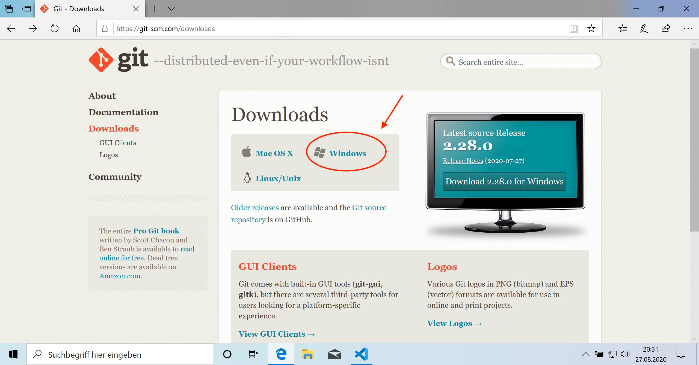
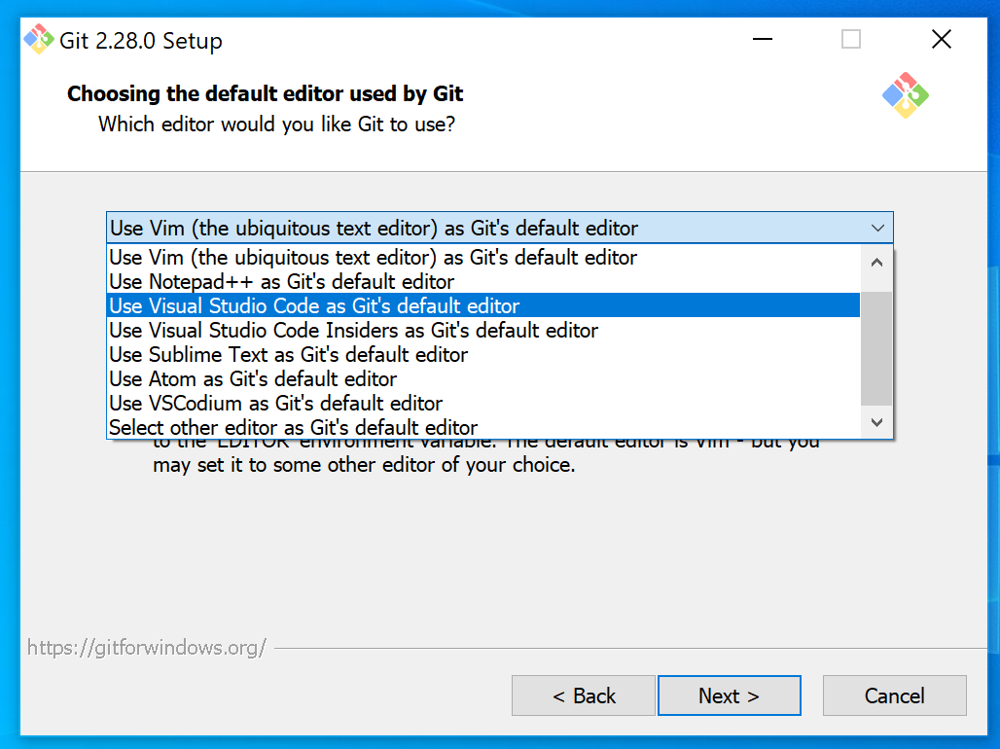
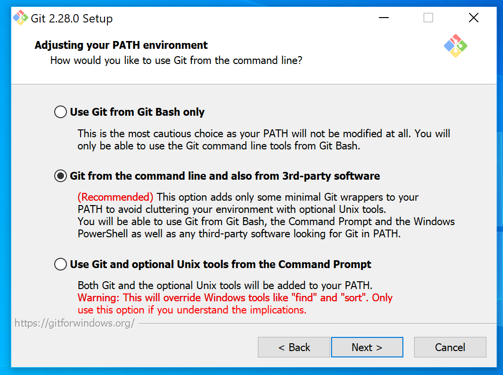

# Installation von Git
## Windows
Die Website [https://git-scm.com/downloads](https://git-scm.com/downloads) öffnen, die Installationsdatei herunterladen und installieren.

Empfohlen: Bei diesem Schritt [Visual Studio Code](code.visualstudio.com) als Standardeditor auswählen.

Wichtig: Bei diesem Schritt, wo die mittlere Checkbox standardmäßig ausgewählt ist, nichts verändern! 

In den übrigen Schritten ebenfalls einfach die Standardeinstellungen belassen.

## macOS
Die einfachste Methode ist, Git über den Paketmanager Homebrew zu installieren:

1. Falls noch nicht geschehen, [Homebrew installieren](https://brew.sh/index_de) (Unglaublich praktisch)
2. `brew install git` in Terminal ausführen.

## Linux
Wie gewohnt über einen Paketmanager installieren.

Beispiel Ubuntu:
`apt install git`

Weitere Informationen: [https://git-scm.com/download/linux](https://git-scm.com/download/linux)