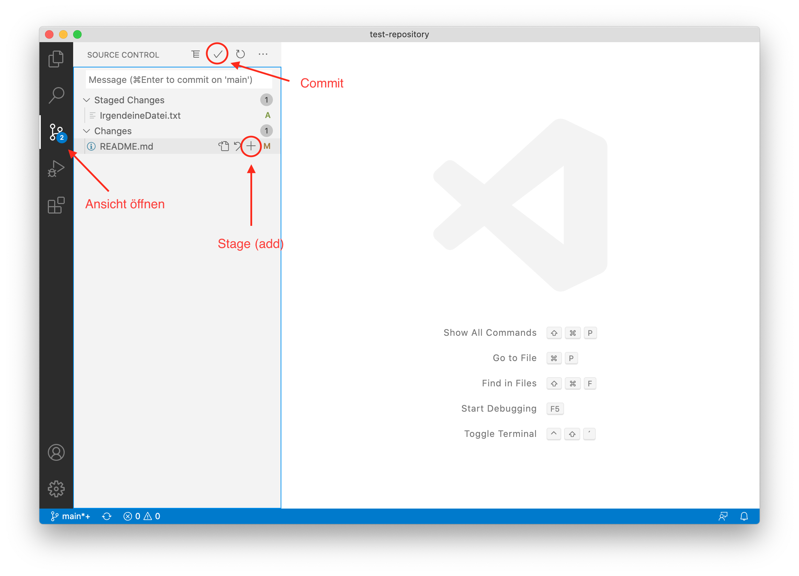

# Git in Visual Studio Code
[Visual Studio Code](https://code.visualstudio.com/) bietet eine grafische Benutzeroberfläche, mit der man Git Befehle einfacher ausführen kann.

Wenn man die Source Control Ansicht öffnet, werden die Dateien mit Veränderungen angezeigt. 
Mit dem Plus neben der Datei kann man diese zum nächsten Commit hinzufügen (`git add`). 
Diese werden dann unter Staged Changes angezeigt. 
Mit dem Pfeil neben dem Plus kann man auch die Veränderungen an der Datei rückgängig machen. 
Mit dem Häkchen oben führt man anschließend den eigentlichen Commit durch (`git commit`).

Wenn man auf die drei Punkte klickt, erscheinen mehr Optionen zum auswählen.

Wichtig und häufig benutzt sind vor allem Push und Pull (`git push` und `git pull`).

Weitere Informationen und die offizielle Dokumentation unter:

[https://code.visualstudio.com/docs/editor/versioncontrol#_git-support](https://code.visualstudio.com/docs/editor/versioncontrol#_git-support)