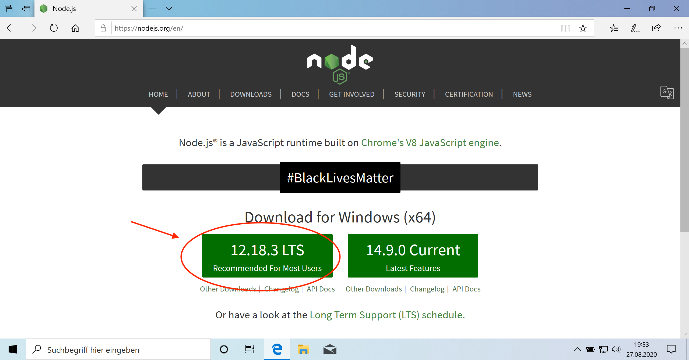
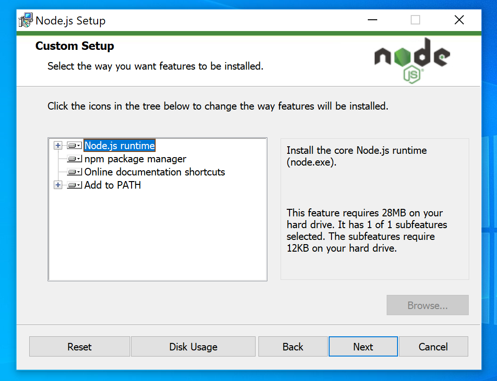
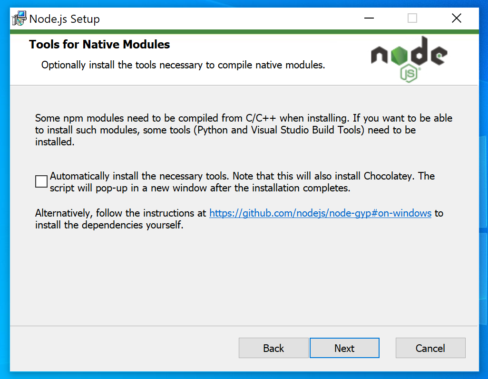
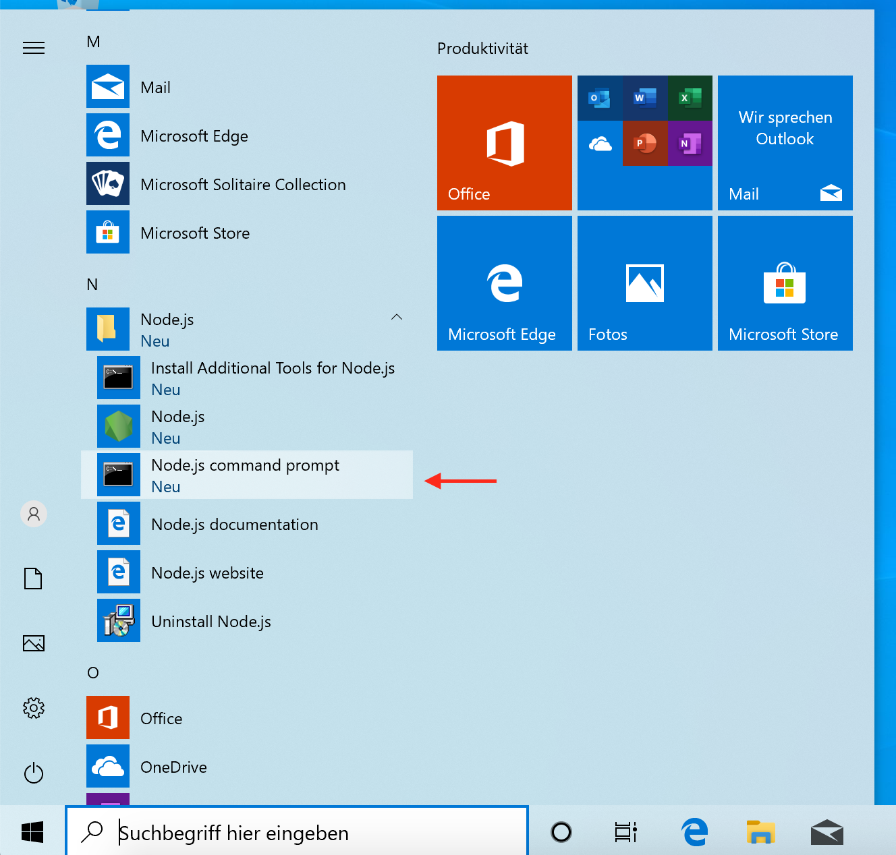
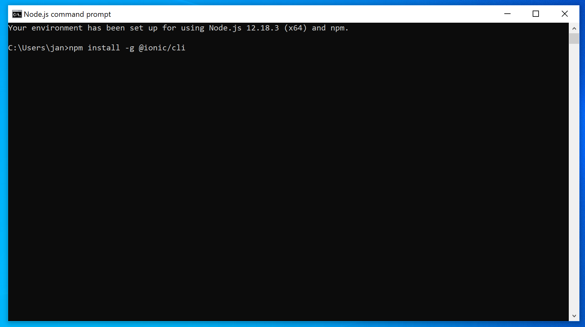
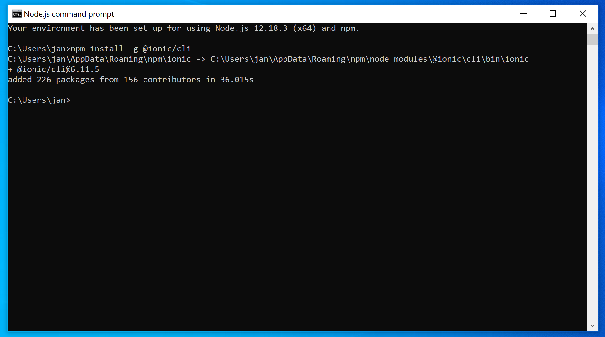

# Ionic Projekt Installationsanleitung (Windows)
#### Schritte
1. Node.js und Ionic installieren
2. Visual Studio Code installieren
3. Git installieren (Für die Teamarbeit)

## Node.js und Ionic installieren

1. Die Website [https://nodejs.org](https://nodejs.org) öffnen und die Installationsdatei für Node.js (LTS Version) herunterladen. 

2. Die Installationsdatei ausführen und durchklicken. Dabei bitte beachten: In diesem Schritt keine Einstellungen verändern!

"Tools for native modules" müssen nicht installiert werden

3. Wenn die Installation fertig ist, Node.js command promt öffnen.

4. In das Befehlszeilenfenster `npm install -g @ionic/cli` eingeben und auf Enter drücken. Hiermit wird die Ionic CLI installiert. Die Installation kann ein paar Minuten dauern.

5. Die Installation kann ein paar Minuten dauern. Wenn sie fertig ist, sieht es wieder so aus wie im Bild. Dann kann das Befehlszeilenfenster wieder geschlossen werden. 

## Visual Studio Code installieren
Die Website [https://code.visualstudio.com/](https://code.visualstudio.com/) öffnen, die Installationsdatei herunterladen und installieren (durchklicken). 

## Git installieren
1. Die Website [https://git-scm.com/downloads](https://git-scm.com/downloads) öffnen, die Installationsdatei herunterladen und installieren. Dabei bitte beachten: 

Bei diesem Schritt Visual Studio Code als Standardeditor auswählen. 

Bei diesem Schritt, wo die mittlere Checkbox standardmäßig ausgewählt ist, nichts verändern! 

In den übrigen Schritten ebenfalls einfach die Standardeinstellungen belassen.

#### Fertig!
