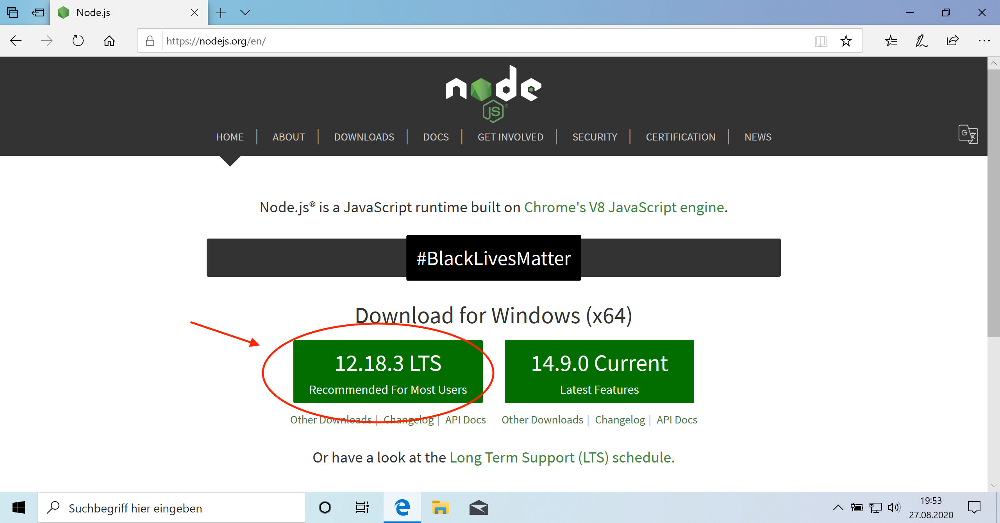
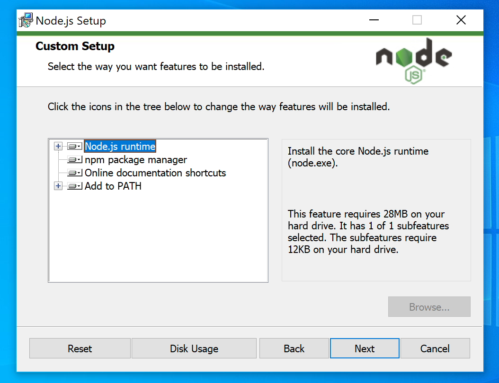
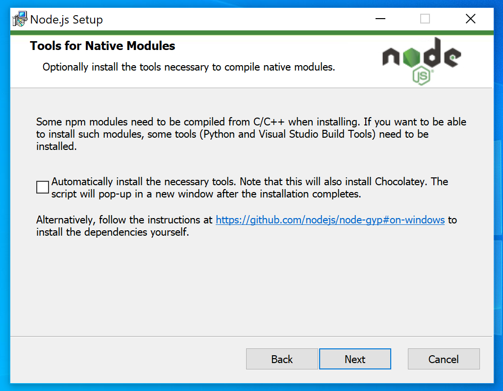
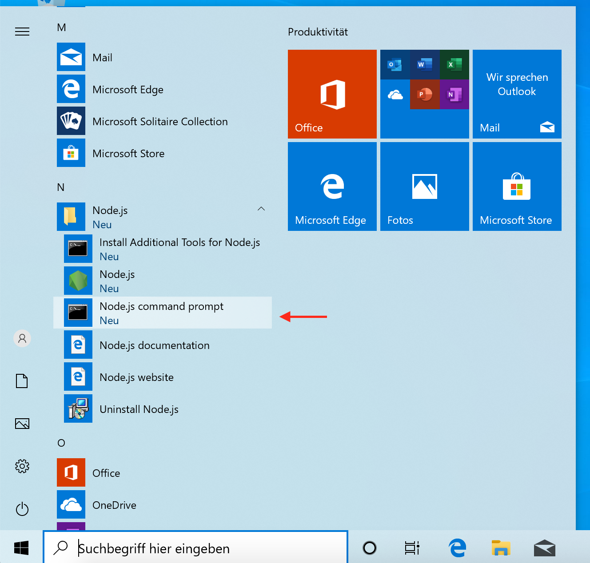
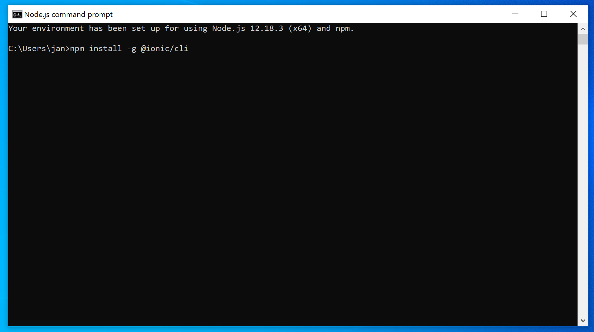
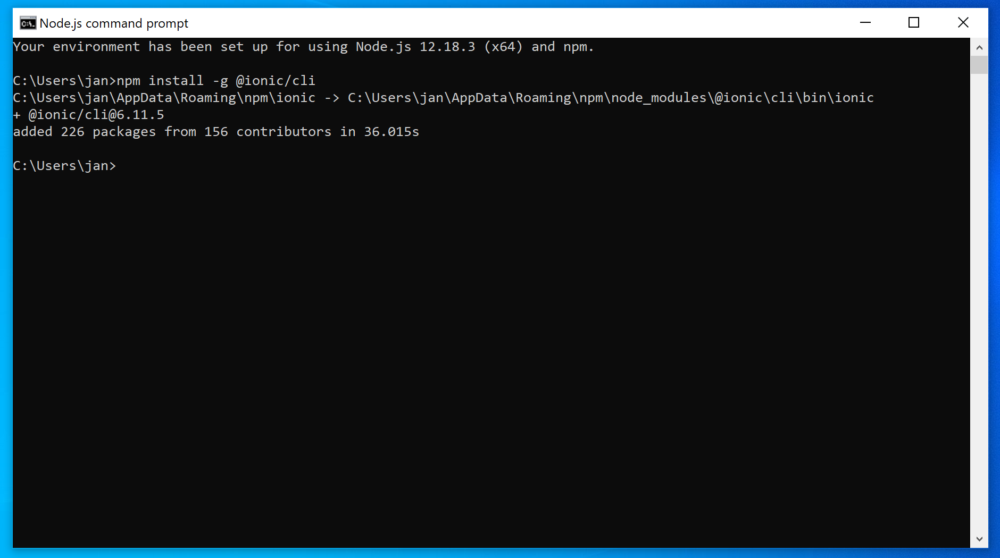

# Ionic Projekt Installationsanleitung
### Schritte
1. Node.js installieren
2. Ionic CLI installieren

## Windows
1. Die Website [https://nodejs.org](https://nodejs.org) öffnen und die Installationsdatei für Node.js (LTS Version) herunterladen. 



2. Die Installationsdatei ausführen und durchklicken. Dabei bitte beachten: In diesem Schritt keine Einstellungen verändern!



"Tools for native modules" müssen nicht installiert werden



3. Wenn die Installation fertig ist, Node.js command promt öffnen.



4. In das Befehlszeilenfenster `npm install -g @ionic/cli` eingeben und auf Enter drücken. Hiermit wird die Ionic CLI installiert. Die Installation kann ein paar Minuten dauern.


5. Die Installation kann ein paar Minuten dauern. Wenn sie fertig ist, sieht es wieder so aus wie im Bild. Dann kann das Befehlszeilenfenster wieder geschlossen werden. 


## macOS
Wenn man auf macOS direkt Node.js installiert, kommt es manchmal zu Berechtigungsfehler. 
Daher empfielt sich die Installation über den [Node Version Manager (nvm)](https://github.com/nvm-sh/nvm).
Dazu die Installationsanleitung unter folgendem Link befolgen: 

[https://github.com/nvm-sh/nvm#install--update-script](https://github.com/nvm-sh/nvm#install--update-script)

Nach der Installation von nvm folgenden Befehl im Terminal ausführen, um die aktuelle LTS-Version von Node.js zu installieren:

```
nvm install --lts
```

Anschließend Ionic mit npm (Node Package Manager) installieren:

```
npm install -g @ionic/cli
```
