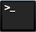
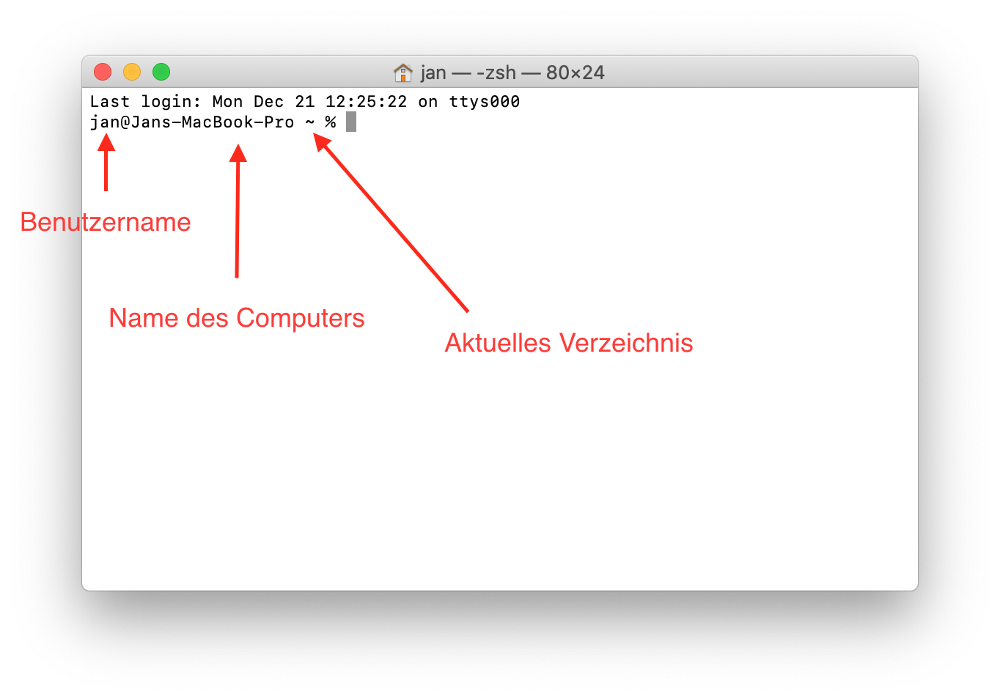

#  macOS und Linux Terminal

Nachdem man den Terminal auf dem Mac geöffnet hat, wird der Benutzername, der Name des Computers, sowie der Name des aktuellen Verzeichnisses angezeigt. Die Tilde (`~`) steht dabei für das **Heimverzeichnis** (`/User/Benutzername/` bei macOS und `/home/Benutzername` bei Linux)



Nun kann man unterschiedliche Befehle eingeben und anschließend mit Enter ausführen.

Tipps:
- Mit der Tab-Taste kann man Befehle und Pfade vervollständigen lassen.
- Mit den Pfeiltasten nach oben und unten kann man zu vorher ausgeführte Befehle zurückblättern.
- Strg-C bricht den aktuellen Vorgang ab (falls sich mal was aufhängt)

## Die wichtigsten Befehle
- `ls` (list) zeigt den Inhalt eines Ordners an.

  Beispiel: `ls Ordnername`
  
  Wird kein Ornder oder Pfad angegeben, wird der Inhalt des aktuellen Verzeichnisses angezeigt.

  Mit `ls -a Ordnername` werden auch versteckte Ordner und Dateien angezeigt. Der Ordner `.` steht dabei für das aktuelle Verzeichnis, der Ordner `..` für das übergeordnete Verzeichnis.
  
  Mit `ls -l Orndername` werden die Ergebnisse im Detailansicht in einer Liste angezeigt.

  Es kann auch beides kombiniert werden: `ls -la Ordnername`

- `cd` (change directory) wechselt das aktuelle Verzeichnis in das angegebene Verzeichnis.

  Beispiel: `cd Ordnername`

  oder `cd Ordner/Unterordner`

  Wird kein Ordner oder Pfad angegeben, wird in das Heimverzeichnis gewechselt (`/User/Benutzername/` in macOS und `/home/Benutzername` auf Linux).

  Mit `cd ..` (Zwei Punkte) kann man in das Übergeordnete Verzeichnis wechseln.

- `pwd` (print working directory) zeigt den vollständigen Pfad des aktuellen Verzeichnisses an.

- `cp` (copy) kopiert Dateien.

  Syntax: `cp Pfad/Quelldatei Pfad/Zieldatei`

- `mv` (move) verschiebt Dateien.

  Syntax: `mv Pfad/Quelldatei Pfad/Zieldatei`

  Kann auch zur Umbenennung einer Datei verwendet werden

- `rm` (remove) löscht Dateien.
  
  Syntax: `rm Pfad/Datei`

  Wenn man einen leeren Ordner löschen will, kann man `rm -d Ordner` oder `rmdir Ordner` benutzen.

  Wenn man einen Ordner samt Inhalt löschen will, kann man `rm -d -r Ornder` benutzen.

- `mkdir` (make directory) erzeugt einen neuen Ordner.

  Syntax: `mkdir NeuerOrdner`

- `sudo` führt einen Befehl als Administrator aus.

  Beispiel: `sudo rm Datei`

- `man` (manual) zeigt die Dokumentation von einem Befehl an.

  Beispiel: `man cp`

  Wenn man fertig mit lesen ist, schließt man die Dokumentation, indem man auf der Tastatur die Taste Q drückt.

## Pfade
In Betriebssystemen, die auf Unix basieren (macOS, Linux, FreeBSD, etc.) sind alle Dateien und Verzeichnisse unter einem einzigen Wurzelverzeichnis eingebunden (im Gegensatz zu Windwos, wo es Laufwerksbuchstaben gibt). Dieses Wurzelverzeichnis wird mit einem Schrägstrich (`/`) bezeichnet.

Der Pfad zu einem Verzeichnis oder einer Datei wird folgendermaßen geschrieben:

```/Ordner/Unterordner/```

oder 

```/Ordner/Unterordner/Datei```

Für das Heimverzeichnis eines Benutzers (`/User/Benutzername`auf macOS sowie `/home/Benutzername/` auf Linux) gibt es die Abkürzung `~` (Tilde). Auf der Mac Tastatur wird dieses Symbol mit Alt+N eingegeben. 

Der Pfad `~/testOrdner` bedeutet also voll ausgeschrieben `/home/Benutzername/testOrdner` bzw. `/User/Benutzername/testOrdner`.

### Wildcards

Mithilfe von Wildcards kann man viele Dateien bei einem Befehl angeben.

- `*` steht für eine beliebige Zeichenkette.

  Beispiel: `rm *.txt` löscht alle Dateien in diesem Verzeichnis mit der Dateiendung .txt

- `?` steht für ein einzelnes beliebiges Zeichen.
  
  Beispiel: `rm datei?.txt` löscht alle Dateien datei1.txt, datei2.txt, dateiA.txt, dateiB.txt usw.