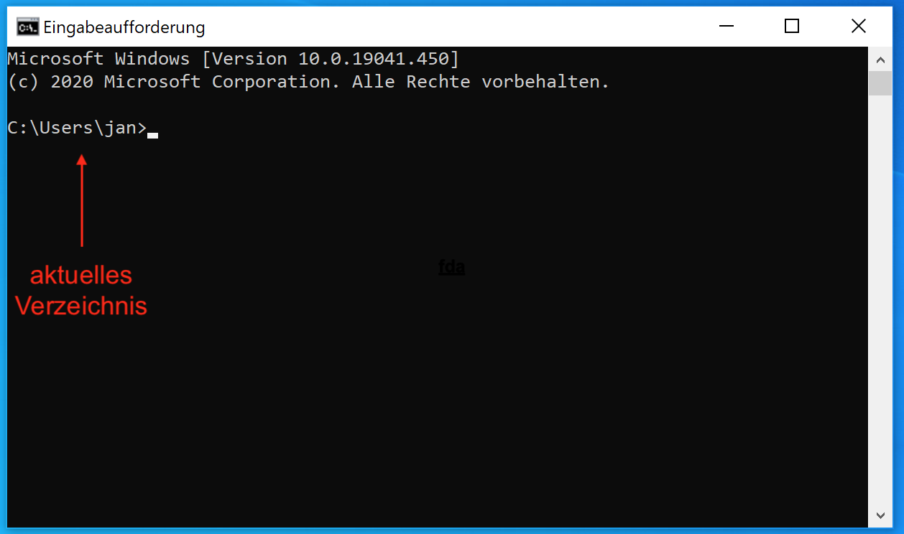

#  Windows Eingabeaufforderung

Mit der Eingabeaufforderung kann man unterschiedliche Befehle ausführen. Am Anfang von jeder Zeile steht der Pfad des aktuellen Verzeichnisses.



Nun kann man unterschiedliche Befehle eingeben und anschließend mit Enter ausführen.

Tipps:
- Mit der Tab-Taste kann man Pfade vervollständigen lassen.
- Mit den Pfeiltasten nach oben und unten kann man zu vorher ausgeführte Befehle zurückblättern.
- Strg-C bricht den aktuellen Vorgang ab (falls sich mal was aufhängt)

## Die wichtigsten Befehle

- `dir` (directory) zeigt den Inhalt eines Ordners an.

  Beispiel: `dir Ordnername`

  Das Ergebnis `.` steht dabei für das aktuelle Verzeichnis, das Ergebnis `..` für das übergeordnete Verzeichnis.
  
  Wird kein Ornder oder Pfad angegeben, wird der Inhalt des aktuellen Verzeichnisses angezeigt.

- `cd` (change directory) wechselt das aktuelle Verzeichnis in das angegebene Verzeichnis.

  Beispiel: `cd Ordnername`

  oder `cd Ordner\Unterordner`

  Mit `cd ..` (Zwei Punkte) kann man in das Übergeordnete Verzeichnis wechseln.

  Möchte man auf ein anderes Laufwerk wechseln, gibt man den Laufwerkbuchstaben mit einem Doppelpunkt (ohne `cd`) ein und bestätigt mit Enter. Anschließend kann man mit cd in Unterordner des Laufwerks wechseln.

  Beispiel:
  ```
  D:
  cd testOrdner
  ```
  Ergebnis: `D:\testOrdner`

- `copy` kopiert Dateien.
  
  Syntax: `copy Pfad\Quelldatei Pfad\Zieldatei`

- `move` verschiebt Dateien.

  Syntax: `move Pfad\Quelldatei Pfad\Zieldatei`

- `rename` benennt Dateien um.

  Syntax: `rename Pfad\Quelldatei DateinameNeu`

- `del` löscht Dateien (aber keine Ordner).
  
  Syntax: `del Pfad/Datei`

  Mit `del /s Pfad` kann man Dateien in sämtlichen Unterordner löschen.

- `mkdir` legt einen neuen Ordner an.

- `rmdir` löscht einen (leeren) Ordner.

## Pfade

Unter Windows werden Backslashes (`\`) als Trennstriche in Pfade verwendet. Normale Schrägstriche funktionieren manchmal auch, sollten aber wegen Verwechslungsgefahr vermieden werden.

### Wildcards

Mithilfe von Wildcards kann man viele Dateien bei einem Befehl angeben.

- `*` steht für eine beliebige Zeichenkette.

  Beispiel: `del *.txt` löscht alle Dateien in diesem Verzeichnis mit der Dateiendung .txt

- `?` steht für ein einzelnes beliebiges Zeichen.
  
  Beispiel: `del datei?.txt` löscht alle Dateien datei1.txt, datei2.txt, dateiA.txt, dateiB.txt usw.